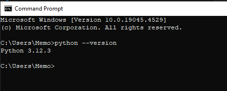

[](https://classroom.github.com/a/vbnbTt5m)
[](https://classroom.github.com/online_ide?assignment_repo_id=15278382&assignment_repo_type=AssignmentRepo)
# Dev_Setup
Setup Development Environment

#Assignment: Setting Up Your Developer Environment

#Objective:
This assignment aims to familiarize you with the tools and configurations necessary to set up an efficient developer environment for software engineering projects. Completing this assignment will give you the skills required to set up a robust and productive workspace conducive to coding, debugging, version control, and collaboration.

#Tasks:

1. Select Your Operating System (OS):
   Choose an operating system that best suits your preferences and project requirements. Download and Install Windows 11. https://www.microsoft.com/software-download/windows11  
  
   ### Download and Install Windows 11
*Instructions:*
- Visit the [Windows 11 download page](https://www.microsoft.com/software-download/windows11).
- Click "Download now" to get the Windows 11 Installation Assistant.
- Run the Installation Assistant and follow the on-screen instructions to upgrade your system to Windows 11

**Troubleshooting:**
- Ensure your PC meets the minimum system requirements for Windows 11.

- If the installation fails, check for updates on Windows 10 and try again.


2. Install a Text Editor or Integrated Development Environment (IDE):
   Select and install a text editor or IDE suitable for your programming languages and workflow. Download and Install Visual Studio Code. https://code.visualstudio.com/Download

   ### Install Visual Studio Code
*Instructions:*
- Visit the [Visual Studio Code download page](https://code.visualstudio.com/Download).
- Download the installer for your operating system.
- Run the installer and follow the setup instructions.

**Configuration:**
- **Extensions:** 
Open Visual Studio Code, go to the Extensions view (`Ctrl+Shift+X`), and install the following extensions:
  - Python
  - GitLens
  - Prettier - Code formatter
  - ESLint
  
3. Set Up Version Control System:
   Install Git and configure it on your local machine. Create a GitHub account for hosting your repositories. Initialize a Git repository for your project and make your first commit. https://github.com
   ### Set Up Version Control System with Git and GitHub
*Instructions:*
- Download Git from the [official Git website](https://git-scm.com/downloads) and install it.
- Open Git Bash (or Command Prompt) and configure Git with your name and email:
   
   git config --global user.name "Your Name"
   git config --global user.email "you@example.com"
   This is how your terminal will look like 
   
- Create a GitHub account at [GitHub](https://github.com).
- Create a new repository on GitHub:
   - Go to your GitHub profile.
   - Click on "Repositories" > "New". 
   - Enter a repository name and click "Create repository".
- Initialize a Git repository for your project (type the following on the Git terminal)
   
          mkdir my_project
          cd my_project
          git init
          touch README.md
          git add README.md
          git commit -m "Initial commit"
             
- Link the local repository to GitHub and push the changes:(type the following on the Git terminal)

         git remote add origin https://github.com/cynthiaChepkemoi/my_project.git
         git push -u origin master
   

**Troubleshooting:**
- Ensure your internet connection is stable.
- If you encounter authentication issues, consider using SSH keys.
   

4. Install Necessary Programming Languages and Runtimes:
  Instal Python from http://wwww.python.org programming language required for your project and install their respective compilers, interpreters, or runtimes. Ensure you have the necessary tools to build and execute your code.

  ###  Install Python
*Instructions:*
- Download Python from the [official Python website](https://www.python.org).
- Run the installer and make sure to check the "Add Python to PATH" option.
- Verify the installation by opening Command Prompt and typing:
       python --version
   
**Troubleshooting:**
- If Python is not recognized, re-install and ensure "Add Python to PATH" is checked.


5. Install Package Managers:
   If applicable, install package managers like pip (Python).

   ### Install Package Managers (pip for Python)
*Instructions:*
- Pip is included with Python. Verify its installation by typing:
      pip --version
   
**Configuration:**
- To install a package (e.g., `requests`), use:
      pip install requests
   
**Troubleshooting:**
- If pip is not found, ensure Python is correctly installed and added to PATH.


6. Configure a Database (MySQL):
   Download and install MySQL database. https://dev.mysql.com/downloads/windows/installer/5.7.html

   ### Configure MySQL Database
*Instructions:*
- Download MySQL from the [MySQL download page](https://dev.mysql.com/downloads/windows/installer/5.7.html).
- Run the installer and follow the setup wizard:
   - Select "Developer Default" setup type.
   - Configure the MySQL Server instance with a root password and other necessary settings.
- Test the installation by opening the MySQL Command Line Client and logging in with the root user.

**Troubleshooting:**
- If you encounter port conflicts, change the port during the MySQL Server configuration.


7. Set Up Development Environments and Virtualization (Optional):
   Consider using virtualization tools like Docker or virtual machines to isolate project dependencies and ensure consistent environments across different machines.

   ###  Set Up Development Environments and Virtualization (Optional)
*Instructions:*
- Download Docker from the [Docker website](https://www.docker.com/products/docker-desktop).
- Click Install for windows 
- Install Docker and follow the setup instructions.
- Create a `Dockerfile` for your project to define your environment.

**Example `Dockerfile`:**
   ```dockerfile
   # Use an official Python runtime as a parent image
   FROM python:3.8-slim

   # Set the working directory in the container
   WORKDIR /app

   # Copy the current directory contents into the container at /app
   COPY . /app

   # Install any needed packages specified in requirements.txt
   RUN pip install --no-cache-dir -r requirements.txt

   # Make port 80 available to the world outside this container
   EXPOSE 80

   # Define environment variable
   ENV NAME World

   # Run app.py when the container launches
   CMD ["python", "app.py"]
   ```

**Troubleshooting:**
- Ensure Docker Desktop is running.
- Verify Docker installation with `docker --version`.


8. Explore Extensions and Plugins:
   Explore available extensions, plugins, and add-ons for your chosen text editor or IDE to enhance functionality, such as syntax highlighting, linting, code formatting, and version control integration.

   ### Explore Extensions and Plugins for Visual Studio Code
**Instructions:**
- Open Visual Studio Code.
- Go to the Extensions view (`Ctrl+Shift+X`).
- Search and install useful extensions like:
   - Python
   - GitLens
   - Prettier - Code formatter
   - ESLint
     


9. Document Your Setup:
    Create a comprehensive document outlining the steps you've taken to set up your developer environment. Include any configurations, customizations, or troubleshooting steps encountered during the process. 

###  Documentation

- **Windows 11 Installation:** Was not able to download this because my PC did not pass the health check
- **Visual Studio Code:** Installed from the link provided. Configured with extensions for Python, GitLens, etc.
- **Git Setup:** Configured Git with user.name and user.email. Initialized repository and pushed to GitHub.
- **Python Installation:** Downloaded from the link provided, added to PATH. Verified installation.
- **MySQL Setup:** Installed from link provided. Configured root user and tested connection.

**Reflection on Challenges:**
- **Issue:** Windows 11 not installed-PC does not meet all requirements 
- **Issue:** Python not recognized in PATH.
  - **Solution:** Reinstalled Python and ensured "Add to PATH" was checked.
- **Issue:** MySQL installation error.
  - **Solution:** Checked MySQL logs and resolved port conflicts.
